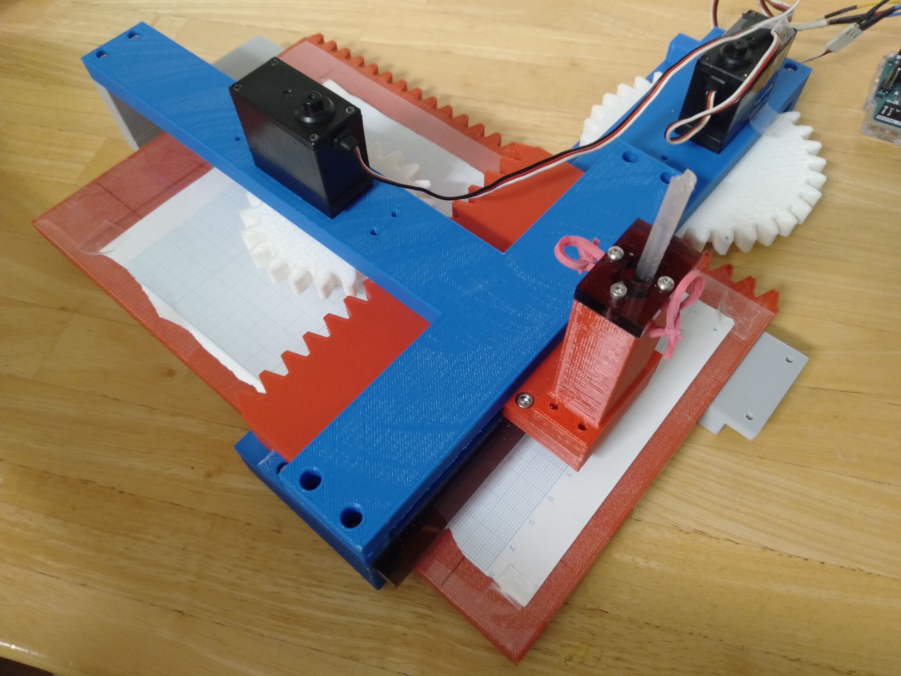

# プロトタイプ演習

## 概要
プロトタイプ演習とは、和歌山高専の4年生の授業の一環で、2つのサーボモータを使い、きれいな直線と渦巻を描くロボットを作成するという課題をこなす。

以下は私たちが作成したマシンの写真である。



このマシンの報告書は以下のPDFから閲覧できます。

[報告書](./docs/報告書_公開用.pdf)

## プロジェクト構成

```
prototype-lesson/
├── src/
│   ├── main/
│   │   └── main.ino          # メイン制御プログラム
│   └── moter_checker/
│       └── moter_checker.ino # モータ精度測定プログラム
├── docs/
│   ├── excel/                # 実験データ・計画書
│   ├── fig/                  # 設計図・フローチャート
│   ├── picture_hardware/     # ハードウェア写真
│   ├── picture_software/     # ソフトウェア画面
│   ├── record/               # 描画結果記録
│   ├── 報告書_公開用.pdf     # プロジェクト報告書
│   └── 報告書_公開用.docx    # プロジェクト報告書
└── README.md
```
